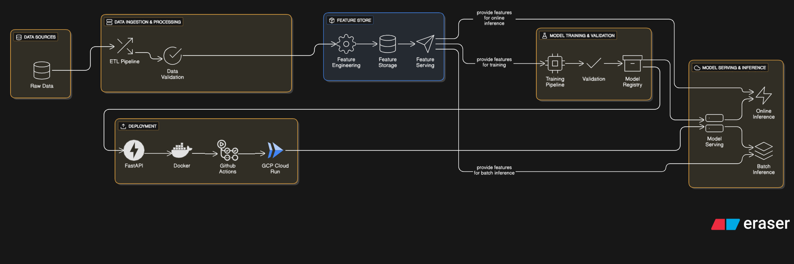

# 🧠 SOM + KMeans Clustering API

This project implements a **Self-Organizing Map (SOM)** combined with **KMeans clustering** to group customer segments from the [Mall Customer Segmentation dataset](https://www.kaggle.com/datasets/vjchoudhary7/customer-segmentation-tutorial). It is built with:

- ⚙️ FastAPI for serving predictions
- 🧪 A modular MLOps pipeline (data ingestion → training → evaluation)
- 🐳 Docker + 🛰️ GitHub Actions CI/CD
- ☁️ Deployed on Google Cloud Run

---

## 📁 Project Structure

```text
som_project/
│
├── src/
│   ├── som/                      # Core SOM logic
│   │   ├── __init__.py
│   │   ├── model.py
│   │   ├── utils.py
│   │   └── config.py
│   │
│   ├── kmeans/                   # Modular KMeans logic
│   │   ├── __init__.py
│   │   ├── cluster.py            # Cluster SOM weights
│   │   └── evaluator.py          # Silhouette score, elbow, etc.
│   │
│   ├── features/
│   │   ├── __init__.py
│   │   ├── generate_features.py
│   │   ├── loader.py
│   │   └── feature_registry.json
│   │
│   ├── pipeline/
│   │   ├── __init__.py
│   │   ├── data_ingestion.py
│   │   ├── data_validation.py
│   │   ├── feature_engineering.py
│   │   ├── model_trainer.py      # ✅ Includes SOM + KMeans
│   │   ├── model_evaluator.py
│   │   └── pipeline_runner.py
│   │
│   ├── api/
│   │   ├── __init__.py
│   │   ├── main.py
│   │   └── routes.py
│   │
│   └── visualizer/
│       ├── __init__.py
│       ├── plots.py
│       └── label_overlay.py
│
├── configs/
│   └── train_config.yaml         # Configs for SOM + KMeans
│
├── data/
│   ├── raw/
│   ├── processed/
│   └── schema.json
│
├── artifacts/
│   ├── models/
│   │   ├── som_model.pkl
│   │   └── kmeans_model.pkl
│   ├── weights/
│   ├── metrics/
│   │   ├── train_metrics.json
│   │   └── clustering_metrics.json
│   └── plots/
│
├── notebooks/
├── scripts/
├── .github/
│   └── workflows/
│       └── deploy.yml
├── Dockerfile
├── pyproject.toml
├── uv.lock
└── README.md
```

## System Architecture Diagram


## 🚀 How to Run Locally

### 1. Install dependencies

```bash
uv pip install --system .
```

### 1. Start FastAPI server

```bash
uvicorn main:app --reload --port 9000
```

